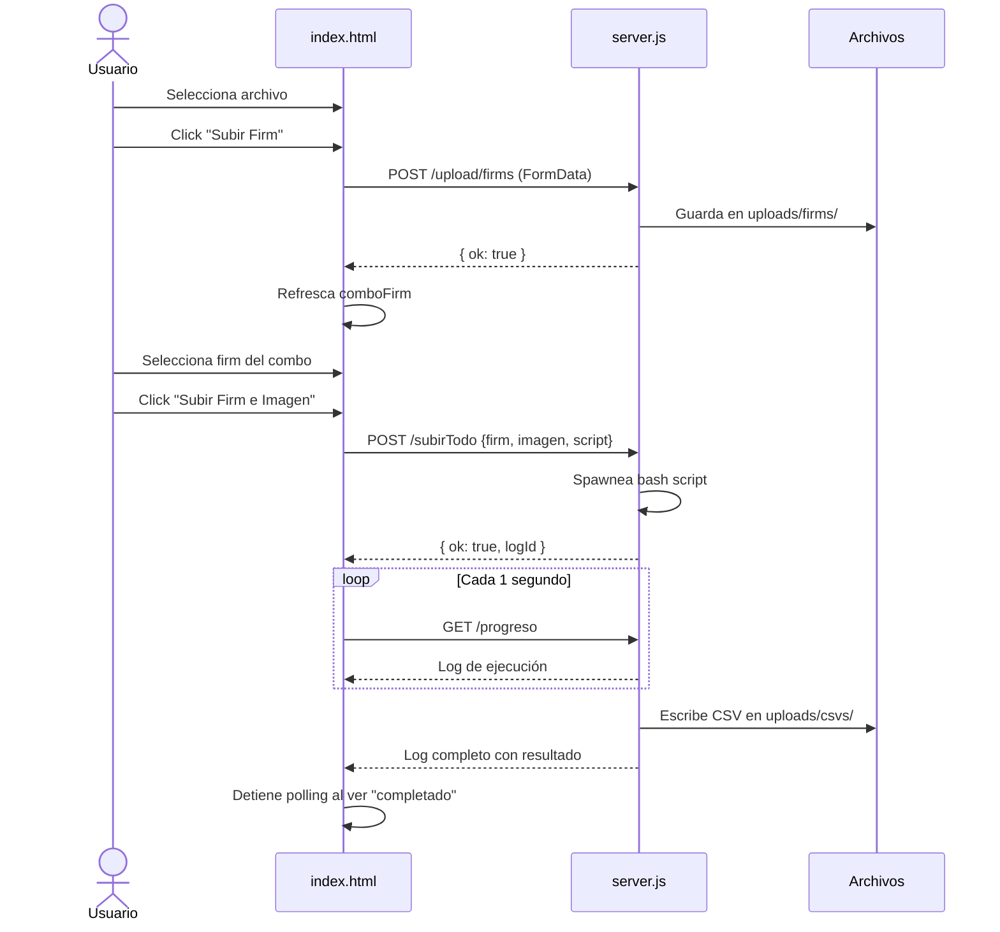

# API Endpoints del Backend

## Flujo de subida y ejecución

## Subida de archivos

| Método | Ruta | Función |
|---|---|---|
| POST | `/upload/firms` | Subir firmware |
| POST | `/upload/imagenes` | Subir imagen de FS |
| POST | `/upload/scripts` | Subir script bash |

Todas usan `multipart/form-data` con campo `file`.

## Listados

| Método | Ruta | Respuesta |
|---|---|---|
| GET | `/listado/firms` | `["archivo1.bin", ...]` |
| GET | `/listado/imagenes` | `["imagen1.bin", ...]` |
| GET | `/listado/scripts` | `["script.sh", ...]` |
| GET | `/listado/csvs` | `["grabacion_2026-05-17.csv", ...]` |

## Ejecución

| Método | Ruta | Body | Descripción |
|---|---|---|---|
| POST | `/subirTodo` | `{ firm, imagen, script }` | Ejecuta el bash script correspondiente |

**Lógica de selección de script:**
- Si `script` está presente → ejecuta el script subido por el usuario
- Si `script` está vacío → ejecuta `grabofirmeimagen.bash` (ESP8266 por defecto)
- El script recibe `firm` e `imagen` como parámetros posicionales ($1, $2)

## Progreso en vivo

| Método | Ruta | Descripción |
|---|---|---|
| GET | `/progreso` | Devuelve el log de la ejecución actual |

El frontend hace **polling** cada 1 segundo a esta ruta mientras dura la ejecución.
Se detiene automáticamente al detectar "completado", "finalizado" o "error".

## Descargas

| Método | Ruta | Descripción |
|---|---|---|
| GET | `/descargar` | Descarga ZIP con firms/scripts/imagenes/csvs |
| GET | `/csv/:nombre` | Devuelve contenido de un CSV específico |
