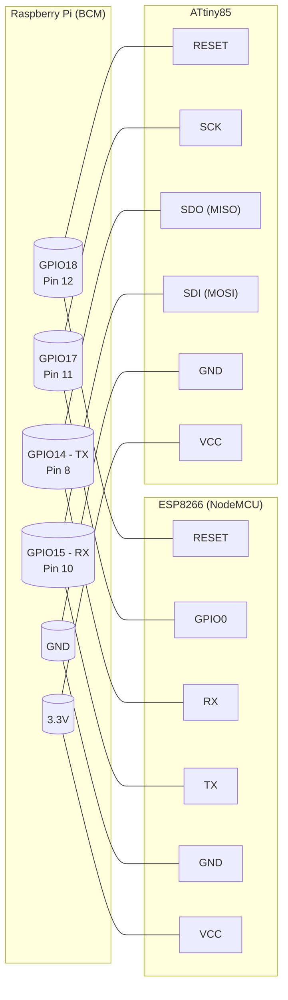
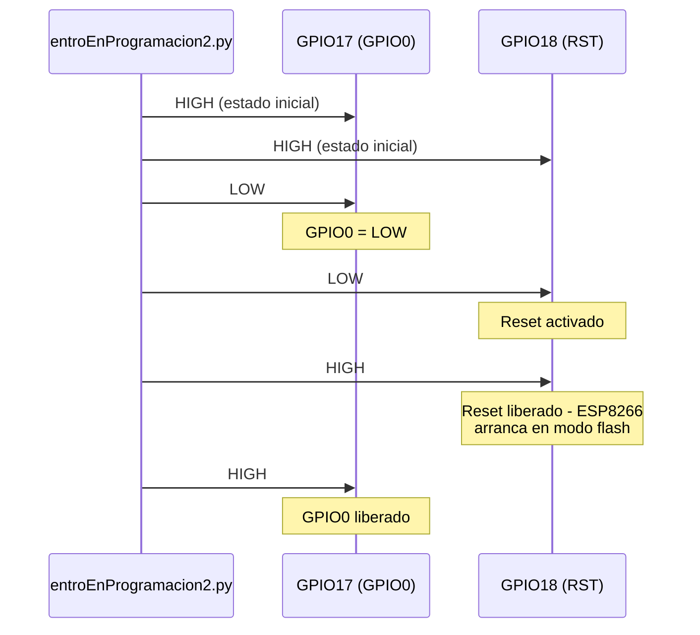

# Pinout - Conexión GPIO

El sistema usa los mismos pines GPIO del Raspberry para ambos microcontroladores.

## Diagrama de conexión

## Mapa de pines (tabla)

| GPIO | Función ESP8266 | Función ATtiny85 | Pin físico RPi |
|---|---|---|---|
| GPIO18 | Reset | Reset | Pin 12 |
| GPIO17 | GPIO0 (modo flash) | SCK | Pin 11 |
| GPIO14 (TXD) | RX | SDO (MISO) | Pin 8 |
| GPIO15 (RXD) | TX | SDI (MOSI) | Pin 10 |
| GND | GND | GND | Pines 6, 14, 39 |
| 3.3V | VCC | VCC | Pines 1, 17 |

## Diagrama de tiempos para entrar en modo programación (ESP8266)

## Notas
- La UART serie en `/dev/ttyAMA0` se usa para comunicación con el ESP8266
- El ATtiny85 se programa por ISP (bitbanging GPIO) a través de avrdude
- El cable es el mismo para ambos MCUs
