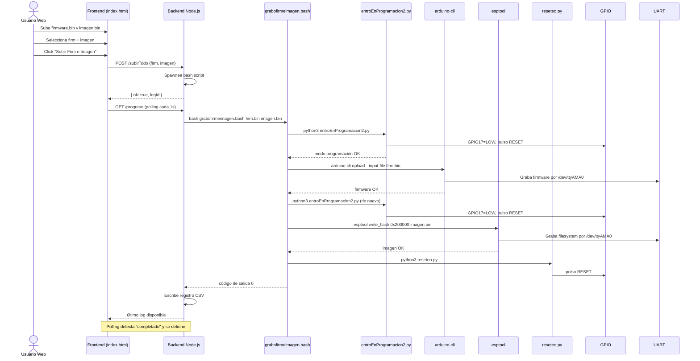
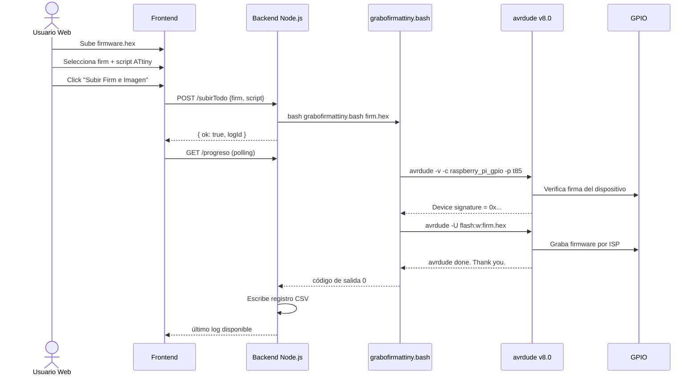
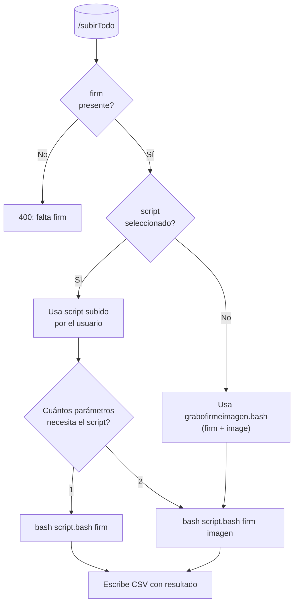

# Diagramas de Flujo

## Grabación ESP8266

```mermaid
sequenceDiagram
    actor User as Usuario Web
    participant UI as Frontend (index.html)
    participant API as Backend Node.js
    participant BASH as grabofirmeimagen.bash
    participant PY as entroEnProgramacion2.py
    participant A_CLI as arduino-cli
    participant ESPT as esptool
    participant RST as reseteo.py

    User->>UI: Sube firmware.bin y imagen.bin
    User->>UI: Selecciona firm + imagen
    User->>UI: Click "Subir Firm e Imagen"
    UI->>API: POST /subirTodo {firm, imagen}
    API->>API: Spawnea bash script
    API-->>UI: { ok: true, logId }
    UI->>API: GET /progreso (polling cada 1s)

    API->>BASH: bash grabofirmeimagen.bash firm.bin imagen.bin
    BASH->>PY: python3 entroEnProgramacion2.py
    PY->>GPIO: GPIO17=LOW, pulso RESET
    PY-->>BASH: modo programación OK

    BASH->>A_CLI: arduino-cli upload --input-file firm.bin
    A_CLI->>UART: Graba firmware por /dev/ttyAMA0
    A_CLI-->>BASH: firmware OK

    BASH->>PY: python3 entroEnProgramacion2.py (de nuevo)
    PY->>GPIO: GPIO17=LOW, pulso RESET

    BASH->>ESPT: esptool write_flash 0x200000 imagen.bin
    ESPT->>UART: Graba filesystem por /dev/ttyAMA0
    ESPT-->>BASH: imagen OK

    BASH->>RST: python3 reseteo.py
    RST->>GPIO: pulso RESET

    BASH-->>API: código de salida 0
    API->>API: Escribe registro CSV
    API-->>UI: último log disponible

    Note over UI,API: Polling detecta "completado" y se detiene
```

## Grabación ATtiny85

```mermaid
sequenceDiagram
    actor User as Usuario Web
    participant UI as Frontend
    participant API as Backend Node.js
    participant BASH as grabofirmattiny.bash
    participant AVR as avrdude v8.0

    User->>UI: Sube firmware.hex
    User->>UI: Selecciona firm + script ATtiny
    User->>UI: Click "Subir Firm e Imagen"
    UI->>API: POST /subirTodo {firm, script}
    API->>BASH: bash grabofirmattiny.bash firm.hex
    API-->>UI: { ok: true, logId }
    UI->>API: GET /progreso (polling)

    BASH->>AVR: avrdude -v -c raspberry_pi_gpio -p t85
    AVR->>GPIO: Verifica firma del dispositivo
    AVR-->>BASH: Device signature = 0x...

    BASH->>AVR: avrdude -U flash:w:firm.hex
    AVR->>GPIO: Graba firmware por ISP
    AVR-->>BASH: avrdude done. Thank you.

    BASH-->>API: código de salida 0
    API->>API: Escribe registro CSV
    API-->>UI: último log disponible
```

## Diagrama de decisión de script

```mermaid
flowchart TD
    START[("/subirTodo")] --> CHECK_FIRM{"firm<br>presente?"}
    CHECK_FIRM -->|No| ERR1["400: falta firm"]
    CHECK_FIRM -->|Sí| CHECK_SCRIPT{"script<br>seleccionado?"}
    CHECK_SCRIPT -->|Sí| USE_CUSTOM["Usa script subido<br>por el usuario"]
    CHECK_SCRIPT -->|No| USE_DEFAULT["Usa grabofirmeimagen.bash<br>(firm + image)"]
    USE_CUSTOM --> CHECK_PARAMS{"Cuántos parámetros<br>necesita el script?"}
    CHECK_PARAMS -->|1| RUN_1["bash script.bash firm"]
    CHECK_PARAMS -->|2| RUN_2["bash script.bash firm imagen"]
    USE_DEFAULT --> RUN_2
    RUN_1 --> LOG_CSV["Escribe CSV con resultado"]
    RUN_2 --> LOG_CSV
```
